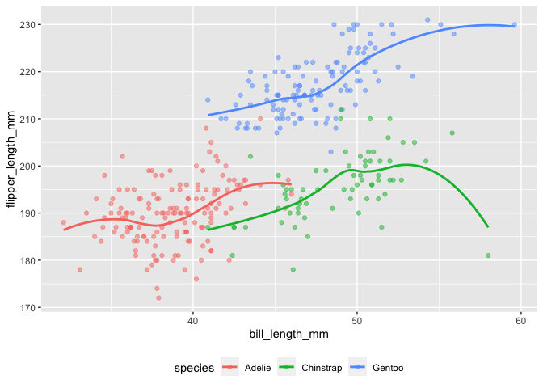

Homework 1
================
Diana Sanchez

This is my solution to HW1.

``` r
library(tidyverse)
```

    ## ── Attaching packages ────────────────────────────────────────────────────────── tidyverse 1.3.0 ──

    ## ✓ ggplot2 3.3.2     ✓ purrr   0.3.4
    ## ✓ tibble  3.0.3     ✓ dplyr   1.0.2
    ## ✓ tidyr   1.1.2     ✓ stringr 1.4.0
    ## ✓ readr   1.3.1     ✓ forcats 0.5.0

    ## ── Conflicts ───────────────────────────────────────────────────────────── tidyverse_conflicts() ──
    ## x dplyr::filter() masks stats::filter()
    ## x dplyr::lag()    masks stats::lag()

## Problem 1

Create a data frame with the specified elements.

``` r
prob1_df =
  tibble(
    samp = rnorm(10),
    samp_gt_0 = samp > 0,
    char_vec = c("a", "b", "c", "d", "e", "f", "g", "h", "i", "j"),
    factor_vec = factor(c("low", "low", "low", "mod", "mod", "mod", "mod", "high", "high", "high"))
)
```

Take the mean of each variable in my data frame.

``` r
mean(pull(prob1_df, samp))
```

    ## [1] -0.1162497

``` r
mean(pull(prob1_df, samp_gt_0))
```

    ## [1] 0.4

``` r
mean(pull(prob1_df, char_vec))
```

    ## Warning in mean.default(pull(prob1_df, char_vec)): argument is not numeric or
    ## logical: returning NA

    ## [1] NA

``` r
mean(pull(prob1_df, factor_vec))
```

    ## Warning in mean.default(pull(prob1_df, factor_vec)): argument is not numeric or
    ## logical: returning NA

    ## [1] NA

I can take the mean of numbers and logical, but not character or factor
variables

``` r
as.numeric(pull(prob1_df, samp))
```

    ##  [1] -0.33703425  0.33356378 -1.63150104  0.98002033 -0.52756243 -0.02278458
    ##  [7]  0.55601676 -0.33527508 -0.73745801  0.55951714

``` r
as.numeric(pull(prob1_df, samp_gt_0))
```

    ##  [1] 0 1 0 1 0 0 1 0 0 1

``` r
as.numeric(pull(prob1_df, char_vec))
```

    ## Warning: NAs introduced by coercion

    ##  [1] NA NA NA NA NA NA NA NA NA NA

``` r
as.numeric(pull(prob1_df, factor_vec))
```

    ##  [1] 2 2 2 3 3 3 3 1 1 1

I can convert logical and factor variables to numeric variables, but I
can’t do this for a character variable.

``` r
as.numeric(pull(prob1_df, samp_gt_0)) * pull(prob1_df, samp)
as.factor(pull(prob1_df, samp_gt_0)) * pull(prob1_df, samp)
as.numeric(as.factor(pull(prob1_df, samp_gt_0))) * pull(prob1_df, samp)
```

I can convert a logical variable to a numerical and then multiply it by
the random sample, but I can’t multiply factor variables by the random
sample. However, I can convert the logical variable to a factor variable
and then to numeric and then multiply by the random sample. However,
this gives me a different result compared to converting the logical
variable directly to a numeric variable.

## Problem 2

``` r
data("penguins", package = "palmerpenguins")

names(penguins)
```

    ## [1] "species"           "island"            "bill_length_mm"   
    ## [4] "bill_depth_mm"     "flipper_length_mm" "body_mass_g"      
    ## [7] "sex"               "year"

``` r
nrow(penguins)
```

    ## [1] 344

``` r
ncol(penguins)
```

    ## [1] 8

``` r
mean(penguins$flipper_length_mm, na.rm=TRUE)
```

    ## [1] 200.9152

``` r
summary(penguins)
```

    ##       species          island    bill_length_mm  bill_depth_mm  
    ##  Adelie   :152   Biscoe   :168   Min.   :32.10   Min.   :13.10  
    ##  Chinstrap: 68   Dream    :124   1st Qu.:39.23   1st Qu.:15.60  
    ##  Gentoo   :124   Torgersen: 52   Median :44.45   Median :17.30  
    ##                                  Mean   :43.92   Mean   :17.15  
    ##                                  3rd Qu.:48.50   3rd Qu.:18.70  
    ##                                  Max.   :59.60   Max.   :21.50  
    ##                                  NA's   :2       NA's   :2      
    ##  flipper_length_mm  body_mass_g       sex           year     
    ##  Min.   :172.0     Min.   :2700   female:165   Min.   :2007  
    ##  1st Qu.:190.0     1st Qu.:3550   male  :168   1st Qu.:2007  
    ##  Median :197.0     Median :4050   NA's  : 11   Median :2008  
    ##  Mean   :200.9     Mean   :4202                Mean   :2008  
    ##  3rd Qu.:213.0     3rd Qu.:4750                3rd Qu.:2009  
    ##  Max.   :231.0     Max.   :6300                Max.   :2009  
    ##  NA's   :2         NA's   :2

The penguins dataset includes the 8 variables: “species”, “island”,
“bill\_length\_mm”, “bill\_depth\_mm”, “flipper\_length\_mm”,
“body\_mass\_g”, “sex”, and “year”. It includes 344 observations
(rows), and, again 8 variables (columns). The mean flipper length, once
the missing values were removed, is 200.9152 mm. Values for “species” in
this data set include “Adelie”, “Chinstrap”, and “Gentoo”. Also, values
for “island” include “Biscoe”, “Dream”, and “Torgersen”.

``` r
penguins %>%
    ggplot (aes(x = bill_length_mm, y = flipper_length_mm, color = species)) +
  geom_point(alpha = .5) +
  geom_smooth(se = FALSE) +
  theme(legend.position = "bottom")
```

    ## `geom_smooth()` using method = 'loess' and formula 'y ~ x'

    ## Warning: Removed 2 rows containing non-finite values (stat_smooth).

    ## Warning: Removed 2 rows containing missing values (geom_point).

<!-- -->

``` r
ggsave("penguins_scatter_plot.pdf", height = 4, width = 6)
```

    ## `geom_smooth()` using method = 'loess' and formula 'y ~ x'

    ## Warning: Removed 2 rows containing non-finite values (stat_smooth).
    
    ## Warning: Removed 2 rows containing missing values (geom_point).
